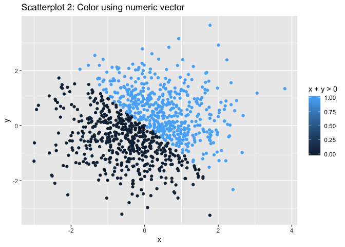

p8105\_hw1\_amv2187
================
Alyssa Vanderbeek
21 September 2018

Problem 1
---------

``` r
n = 10 # 10 rows in the following tbl_df

set.seed(1) # set a seed for reproducibility

# Create tbl_df 
p1_df = tibble(
  unif_10 = runif(n = n, min = 0, max = 5), # random vector of size 10 selected from uniform [0,5]
  greater_than_2 = (unif_10 > 2), # logical vector. TRUE if value generated in unif_10 greater than 2; FALSE if less than or equal to 2
  char_vec = rep('a', n), # character vector of length 10,
  factor_vec = c(rep('Y', n/2), rep('N', n/2)) # factor vector of length 10
)

head(p1_df) # show first few rows of p1_df
```

    ## # A tibble: 6 x 4
    ##   unif_10 greater_than_2 char_vec factor_vec
    ##     <dbl> <lgl>          <chr>    <chr>     
    ## 1    1.33 FALSE          a        Y         
    ## 2    1.86 FALSE          a        Y         
    ## 3    2.86 TRUE           a        Y         
    ## 4    4.54 TRUE           a        Y         
    ## 5    1.01 FALSE          a        Y         
    ## 6    4.49 TRUE           a        N

``` r
# Take mean of each column
avg_num = mean(p1_df$unif_10)
avg_logical = mean(p1_df$greater_than_2)
avg_char = mean(p1_df$char_vec)
avg_factor = mean(p1_df$factor_vec)

# Print column means
print(c(avg_num, avg_logical, avg_char, avg_factor))
```

    ## [1] 2.757569 0.600000       NA       NA

Taking the mean of the numeric and logical vectors in `p1_df` is successful; taking the mean of the character and factor vectors is not. This is intuitive for the numeric vector. In the case of the logical vector, the function `base::mean` automatically converts logical `TRUE`/`FALSE` to numeric 1/0, and takes the arithmetic average. Conversely, characters and factors cannot be converted to a numeric format in any default way, and thus taking the mean cannot be done.

The following code attempts to convert the logical, character, and factor vectors to numeric class. The logical vector successfully convert `TRUE` to 1 and `FALSE` to 0. The character and factor vectors are unable to convert to numeric, and instead return a list of `NA`s.

``` r
as.numeric(p1_df$greater_than_2)
as.numeric(p1_df$char_vec)
as.numeric(p1_df$factor_vec)
```

The next chunk converts character-&gt;factor-&gt;numeric (successfully!), and factor-&gt;character-&gt;numeric (unsuccessfully).

``` r
as.numeric(as.factor(p1_df$char_vec))
as.numeric(as.character(p1_df$factor_vec))
```

Problem 2
---------

``` r
n = 1000 # number of rows in new data frame

# Create tbl_df
p2_df = tibble(
  x = rnorm(n = n),
  y = rnorm(n = n),
  sum_gt_0 = (x + y > 0), # logical vector. TRUE if x+y>0, FALSE otherwise
  num_vec_coerced = as.numeric(sum_gt_0), # coerced numeric vector of sum_gt_0
  factor_vec_coerced = as.factor(sum_gt_0) # coerced character vector of sum_gt_0
)

head(p2_df)
```

    ## # A tibble: 6 x 5
    ##        x      y sum_gt_0 num_vec_coerced factor_vec_coerced
    ##    <dbl>  <dbl> <lgl>              <dbl> <fct>             
    ## 1 -0.820 -1.66  FALSE                  0 FALSE             
    ## 2  0.487  0.811 TRUE                   1 TRUE              
    ## 3  0.738 -1.91  FALSE                  0 FALSE             
    ## 4  0.576 -1.25  FALSE                  0 FALSE             
    ## 5 -0.305  0.998 TRUE                   1 TRUE              
    ## 6  1.51  -0.541 TRUE                   1 TRUE

The number of observations (rows) and variables (columns) in this data frame is (1000, 5), respectively. The mean of x is -0.0106382; the median of x is -0.031318. The proportion of observations for which `x + y > 0` is 0.49.

``` r
plot_1 = ggplot(data = p2_df, aes(x = x, y = y, color = sum_gt_0)) +
  geom_point() + 
  ggtitle('Scatterplot 1: Color using logical vector') +
  labs(color = 'x + y > 0') # legend title
plot_1
```


``` r
ggplot(data = p2_df, aes(x = x, y = y, color = num_vec_coerced)) +
  geom_point() + 
  ggtitle('Scatterplot 2: Color using numeric vector') +
  labs(color = 'x + y > 0')
```



``` r
ggplot(data = p2_df, aes(x = x, y = y, color = factor_vec_coerced)) +
  geom_point() + 
  ggtitle('Scatterplot 3: Color using factor vector') +
  labs(color = 'x + y > 0')
```


As can be seen from the plots, color is assigned in a binary fashion to the logical and factor variables, whereas the numeric vector assigns color on a gradient.

Next, I save the first scatterplot as a PDF.

``` r
getwd()
ggsave("scatterplot_1.pdf", plot = plot_1, height = 4, width = 6)
```
